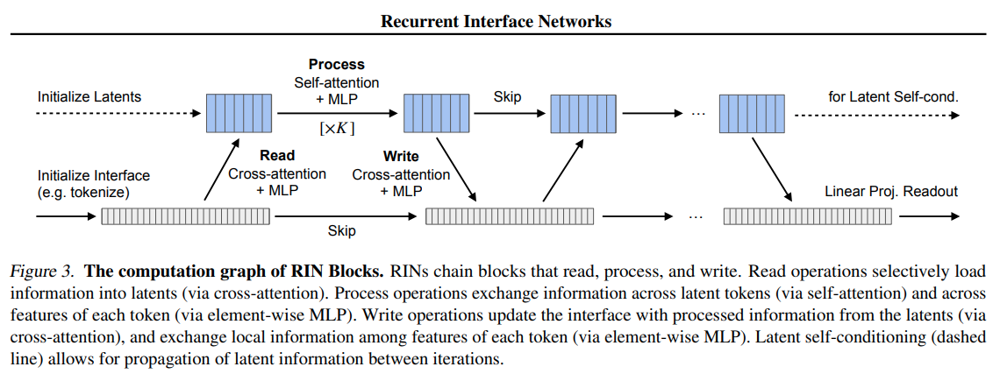

</img>

</img>

## Recurrent Interface Network (RIN) - Pytorch

Implementation of <a href="https://arxiv.org/abs/2212.11972">Recurrent Interface Network (RIN)</a>, for highly efficient generation of images and video without cascading networks, in Pytorch. The author unawaredly reinvented the <a href="https://github.com/lucidrains/isab-pytorch">induced set-attention block</a> from the <a href="https://arxiv.org/abs/1810.00825">set transformers</a> paper. They also combine this with the self-conditioning technique from the <a href="https://arxiv.org/abs/2208.04202">Bit Diffusion paper</a>, specifically for the latents. The last ingredient seems to be a new noise function based around the sigmoid, which the author claims is better than cosine scheduler for larger images.

The big surprise is that the generations can reach this level of fidelity. Will need to verify this on my own machine

Additionally, we will try adding an extra linear attention on the main branch as well as self conditioning in the pixel-space.

The insight of being able to self-condition on any hidden state of the network as well as the newly proposed sigmoid noise schedule are the two main findings.

This repository also contains the ability to <a href="https://arxiv.org/abs/2301.10972">noise higher resolution images more</a>, using the `scale` keyword argument on the `GaussianDiffusion` class. It also contains the simple linear gamma schedule proposed in that paper.

## Appreciation

- <a href="https://stability.ai/">Stability.ai</a> for the generous sponsorship to work on cutting edge artificial intelligence research

## Install

```bash
$ pip install rin-pytorch
```

## Usage

```python
from rin_pytorch import GaussianDiffusion, RIN, Trainer

model = RIN(
    dim = 256,                  # model dimensions
    image_size = 128,           # image size
    patch_size = 8,             # patch size
    depth = 6,                  # depth
    num_latents = 128,          # number of latents. they used 256 in the paper
    dim_latent = 512,           # can be greater than the image dimension (dim) for greater capacity
    latent_self_attn_depth = 4, # number of latent self attention blocks per recurrent step, K in the paper
).cuda()

diffusion = GaussianDiffusion(
    model,
    timesteps = 400,
    train_prob_self_cond = 0.9,  # how often to self condition on latents
    scale = 1.                   # this will be set to < 1. for more noising and leads to better convergence when training on higher resolution images (512, 1024) - input noised images will be auto variance normalized
).cuda()

trainer = Trainer(
    diffusion,
    '/path/to/your/images',
    num_samples = 16,
    train_batch_size = 4,
    gradient_accumulate_every = 4,
    train_lr = 1e-4,
    save_and_sample_every = 1000,
    train_num_steps = 700000,         # total training steps
    ema_decay = 0.995,                # exponential moving average decay
)

trainer.train()
```

Results will be saved periodically to the `./results` folder

If you would like to experiment with the `RIN` and `GaussianDiffusion` class outside the `Trainer`

```python
import torch
from rin_pytorch import RIN, GaussianDiffusion

model = RIN(
    dim = 256,                  # model dimensions
    image_size = 128,           # image size
    patch_size = 8,             # patch size
    depth = 6,                  # depth
    num_latents = 128,          # number of latents. they used 256 in the paper
    latent_self_attn_depth = 4, # number of latent self attention blocks per recurrent step, K in the paper
).cuda()

diffusion = GaussianDiffusion(
    model,
    timesteps = 1000,
    train_prob_self_cond = 0.9,
    scale = 1.
)

training_images = torch.randn(8, 3, 128, 128).cuda() # images are normalized from 0 to 1
loss = diffusion(training_images)
loss.backward()
# after a lot of training

sampled_images = diffusion.sample(batch_size = 4)
sampled_images.shape # (4, 3, 128, 128)
```

## Todo

- [ ] experiment with <a href="https://github.com/lucidrains/bidirectional-cross-attention/issues">bidirectional cross attention</a>
- [ ] add ability to use 2d sinusoidal pos emb, from simple vit paper

## Citations

```bibtex
@misc{jabri2022scalable,
    title   = {Scalable Adaptive Computation for Iterative Generation}, 
    author  = {Allan Jabri and David Fleet and Ting Chen},
    year    = {2022},
    eprint  = {2212.11972},
    archivePrefix = {arXiv},
    primaryClass = {cs.LG}
}
```

```bibtex
@inproceedings{Chen2023OnTI,
    title   = {On the Importance of Noise Scheduling for Diffusion Models},
    author  = {Ting Chen},
    year    = {2023}
}
```

```bibtex
@article{Salimans2022ProgressiveDF,
    title   = {Progressive Distillation for Fast Sampling of Diffusion Models},
    author  = {Tim Salimans and Jonathan Ho},
    journal = {ArXiv},
    year    = {2022},
    volume  = {abs/2202.00512}
}
```

```bibtex
@misc{https://doi.org/10.48550/arxiv.2302.01327,
    doi     = {10.48550/ARXIV.2302.01327},
    url     = {https://arxiv.org/abs/2302.01327},
    author  = {Kumar, Manoj and Dehghani, Mostafa and Houlsby, Neil},
    title   = {Dual PatchNorm},
    publisher = {arXiv},
    year    = {2023},
    copyright = {Creative Commons Attribution 4.0 International}
}
```

```bibtex
@inproceedings{Hang2023EfficientDT,
    title   = {Efficient Diffusion Training via Min-SNR Weighting Strategy},
    author  = {Tiankai Hang and Shuyang Gu and Chen Li and Jianmin Bao and Dong Chen and Han Hu and Xin Geng and Baining Guo},
    year    = {2023}
}
```

```bibtex
@inproceedings{dao2022flashattention,
    title   = {Flash{A}ttention: Fast and Memory-Efficient Exact Attention with {IO}-Awareness},
    author  = {Dao, Tri and Fu, Daniel Y. and Ermon, Stefano and Rudra, Atri and R{\'e}, Christopher},
    booktitle = {Advances in Neural Information Processing Systems},
    year    = {2022}
}
```
