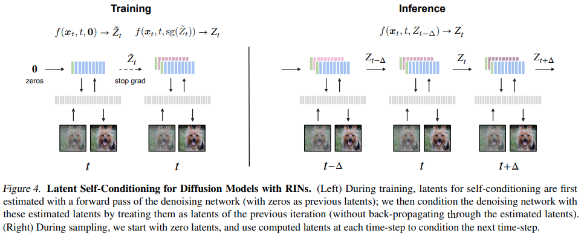

</img>

</img>

## Recurrent Interface Network (RIN) - Pytorch (wip)

Implementation of <a href="https://arxiv.org/abs/2212.11972">Recurrent Interface Network (RIN)</a>, for highly efficient generation of images and video without cascading networks, in Pytorch. The author unawaredly reinvented the <a href="https://github.com/lucidrains/isab-pytorch">induced set-attention block</a> from the <a href="https://arxiv.org/abs/1810.00825">set transformers</a> paper. They also combine this with the self-conditioning technique from the <a href="https://arxiv.org/abs/2208.04202">Bit Diffusion paper</a>, specifically for the latents.

The big surprise is that the generations can reach this level of fidelity. Will need to verify this on my own machine

## Citations

```bibtex
@misc{jabri2022scalable,
    title   = {Scalable Adaptive Computation for Iterative Generation}, 
    author  = {Allan Jabri and David Fleet and Ting Chen},
    year    = {2022},
    eprint  = {2212.11972},
    archivePrefix = {arXiv},
    primaryClass = {cs.LG}
}
```
